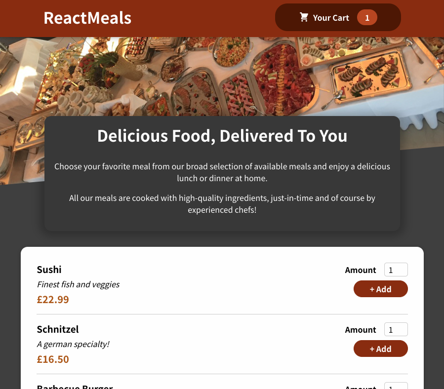
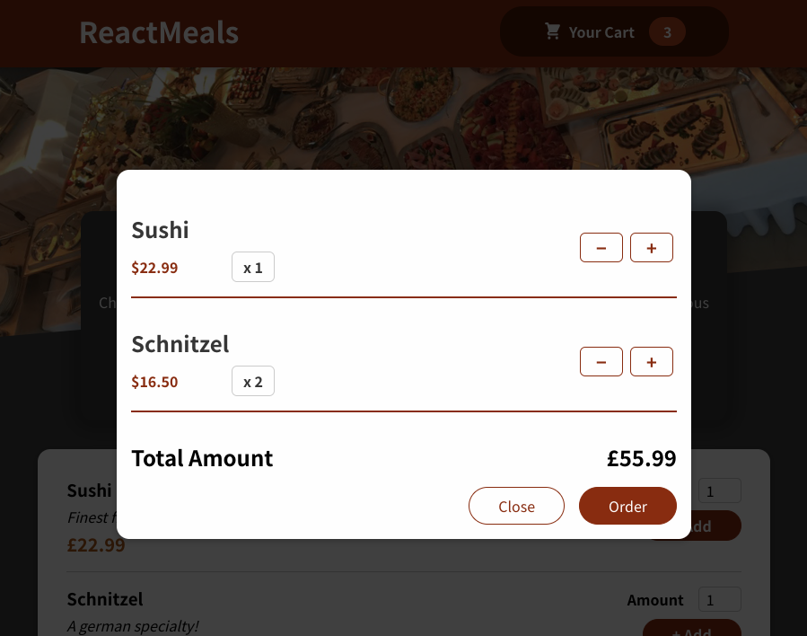

# Project Title

Food to Order React App

## Demo link:

Access my site at [Food to Order React App](https://delightful-rock-0ebe86c03.2.azurestaticapps.net/)

## Table of Content:

- [About The App](#about-the-app)
- [Screenshots](#screenshots)
- [Technologies](#technologies)
- [Setup](#setup)
- [Credits](#credits)

## About The App

The Food to Order React App is project that was part of my learning React journey with Academind's Complete React course, from a about 25% through the course, so it's still pretty basic. It uses State, a Reducer to managed the Cart and an Effect to animate the Cart icon in the header.

## Screenshots

## Technologies

I used ReactJS (via Create React App), html and css.

## Setup

- download or clone the repository
- run `npm install`
- run `npm start`

## Credits

List of contriubutors:

- [Simon Otter](https://github.com/simonotter)
- [React - Complete Guide - from Academind](https://www.udemy.com/course/react-the-complete-guide-incl-redux)